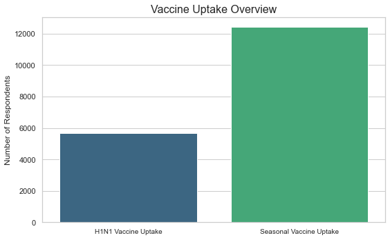

# Understanding Vaccine Uptake: Insights from the H1N1 and Seasonal Flu Dataset

A concise summary of the project and its objectives.

## Summary

This repository contains a datascience project that followsthe standard workflow for for analyzing and modelling data.

1. **Data Collection and Preprocessing**:
    - **Data Collection**: The data used in this project was sourecd from DrivenData(Flu Shot Learning: Predict H1N1 and Seasonal Flu Vaccines)

    - **Preprocessing steps**:
    a. Drop the columns with the highest number of missing values.
    b. Separate the features and the target variables.
    c. Separate numerical and categorical features.
    d. Handle missing values and scale the features.
    e. Encode categorical features.
**
2. **Exploratory Data Analysis (EDA)**:
    **Key Insights**
    There is less uptake of h1n1 vaccine compared touptake of seasonal flu vaccine.

    **Plot**
    

3. **Modelling**
    a. **Logistic Regression**
    Logistic Regression is a probabilistic model that predicts the probability of a binary outcome based on the input features.
    
    **Logistic Regression** is suitable for this analysis because both the H1N1 vaccine and seasonal flu vaccine columns are binary. 

    b.**Random Forest**
    A Random Forest Classifier is a supervised machine learning algorithm used for classification tasks. It is based on an ensemble learning technique, where multiple decision trees are trained on subsets of the data, and their predictions are aggregated (usually by majority vote) to make a final prediction.

    c. **Hyperparameter tuning**
    Hyperparameter tuning is the process of selecting the best set of hyperparameters for a machine learning model to optimize its performance on a given dataset.

4. **Evaluation**
    Metrics used to evaluate the perfomance of the models are:

    a. Precision: Focuses on column "Predicted Positive."
    b. Recall: Focuses on row "Actual Positive."
    c. F1 Score: Combines Precision and Recall into a single score.
    d. AUC: Considers all possible thresholds to evaluate model performance.

    The Random Forest model has a higher AUC score than the Logistic model.

5. **Conclusions and recommendations**:
    1. A doctor's recommendation is the strongest and most consistent factor influencing both H1N1 and Seasonal flu vaccination uptake. Public health organizations should work closely with healthcare providers to encourage vaccine recommendations during patient visits.

    2. Perceptions of vaccine effectiveness strongly influence decision-making. People who believe vaccines are effective are more likely to get vaccinated.

    3. Risk Perception plays a significant role. Individuals who perceive a high risk of contracting H1N1 or the Seasonal Flu are more inclined to get vaccinated, indicating the need for risk awareness campaigns.

## Repository Structure

The Repository is organized as follows:
- **Notebook**: The main analysis and code are documented in `notebook.ipynb`.
- **Data**: Any datasets used in the project are stored in the `data/` directory.
- **README.md**: This file provides an overview and navigation guide for the repository.

## Presentation

A detailed presentation summarizing the project and its results can be found [here](vaccine_presentation.pptx).

## References

- Links to data sources and any external references used in the project:
  - [Source](https://www.drivendata.org/competitions/66/flu-shot-learning/page/211/)
  

## Instructions for Navigation

1. Open `notebook.ipynb` to view the full analysis and code.
2. Check the `data/` folder for raw and processed datasets.
3. Use this `README.md` file as a guide to understand the project structure and contents.

---

Feel free to reach out if you have questions or feedback about the project!